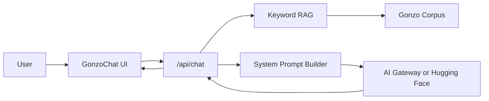

# Gonzo Engine

A Hunter S. Thompson chatbot engine built with **Next.js**, the **Vercel AI SDK**, and lightweight **RAG** grounding over a curated Gonzo style corpus.

## Architecture



## Features

- **Persona engine** — first-person Hunter S. Thompson voice with Gonzo journalism rules
- **RAG grounding** — phrase/alias retrieval over 174 factual and style chunks
- **Voice lock** — core style chunks always injected; the prose stance does not drift
- **Corpus synthesizer** — demo mode composes in-character replies from retrieved knowledge (no LLM)
- **Live LLM mode** — Vercel AI Gateway or Hugging Face when `AI_GATEWAY_API_KEY` / `HF_TOKEN` is set
- **Knowledge debug** — `GET /api/knowledge?q=nixon` shows retriever output
- **Health check** — `GET /api/health` reports provider + corpus status

## Quick start

```bash
npm install
cp .env.example .env.local
# Add your API key to .env.local
npm run dev
```

Open [http://localhost:3000](http://localhost:3000).

## Environment variables

| Variable | Required | Description |
|----------|----------|-------------|
| `AI_GATEWAY_API_KEY` | Recommended | [Vercel AI Gateway](https://vercel.com/ai-gateway) API key |
| `AI_GATEWAY_MODEL` | No | Model ID (default: `anthropic/claude-sonnet-4.5`) |
| `HF_TOKEN` | Alternative | Hugging Face token with Inference API access |
| `HF_MODEL` | No | HF model ID (default: `meta-llama/Meta-Llama-3.1-8B-Instruct`) |
| `GONZO_DEMO_MODE` | No | `true` = corpus synthesizer without an LLM (default in cloud env) |

Gateway is preferred when both keys are set. With no key and `GONZO_DEMO_MODE=true`, the engine still streams Gonzo-style replies synthesized from the knowledge base.

## Project structure

```
src/
├── app/api/
│   ├── chat/route.ts        # Streaming chat
│   └── knowledge/route.ts   # Retrieval debugger
├── components/GonzoChat.tsx
└── lib/gonzo/
    ├── corpus/              # Extensive KB by category
    ├── retrieve.ts          # Phrase + alias RAG
    ├── synthesize.ts        # Demo-mode Gonzo reply composer
    ├── persona.ts
    └── model.ts
```

```bash
npm test
curl "http://localhost:3000/api/knowledge?q=owl%20farm"
```

## Extending the engine

- Add chunks under `src/lib/gonzo/corpus/` — keywords, optional `weight`, `alwaysInclude` for voice lock
- Tune retrieval aliases in `src/lib/gonzo/retrieve.ts`
- Swap models via env vars
- Upgrade later to embeddings if you add an embedding provider

## Deploy

Deploy to [Vercel](https://vercel.com) and add `AI_GATEWAY_API_KEY` as an environment variable. OIDC auth works automatically on Vercel deployments.

## Disclaimer

This is a stylistic homage chatbot. Corpus exemplars are original pastiche, not verbatim copyrighted text. The bot stays in character but refuses harmful requests.
