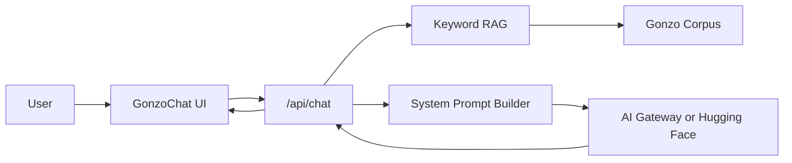

# Gonzo Engine

A Hunter S. Thompson chatbot engine built with **Next.js**, the **Vercel AI SDK**, and lightweight **RAG** grounding over a curated Gonzo style corpus.

## Architecture



## Features

- **Persona engine** — first-person Hunter S. Thompson voice with Gonzo journalism rules
- **RAG grounding** — keyword retrieval over style exemplars, themes, and biographical anchors
- **Streaming chat** — real-time responses via AI SDK `useChat`
- **Dual provider support** — Vercel AI Gateway (recommended) or Hugging Face Inference
- **Gonzo UI** — dark amber/red aesthetic with conversation starters

## Quick start

```bash
npm install
cp .env.example .env.local
# Add your API key to .env.local
npm run dev
```

Open [http://localhost:3000](http://localhost:3000).

## Environment variables

| Variable | Required | Description |
|----------|----------|-------------|
| `AI_GATEWAY_API_KEY` | Recommended | [Vercel AI Gateway](https://vercel.com/ai-gateway) API key |
| `AI_GATEWAY_MODEL` | No | Model ID (default: `anthropic/claude-sonnet-4.5`) |
| `HF_TOKEN` | Alternative | Hugging Face token with Inference API access |
| `HF_MODEL` | No | HF model ID (default: `meta-llama/Meta-Llama-3.1-8B-Instruct`) |

Gateway is preferred when both keys are set.

## Project structure

```
src/
├── app/
│   ├── api/chat/route.ts    # Streaming chat endpoint
│   ├── layout.tsx
│   └── page.tsx
├── components/
│   └── GonzoChat.tsx        # Chat UI
└── lib/gonzo/
    ├── corpus.ts            # Style & context chunks
    ├── retrieve.ts          # Keyword RAG
    ├── persona.ts           # System prompt builder
    └── model.ts             # Provider configuration
```

## Extending the engine

- **Add corpus chunks** in `src/lib/gonzo/corpus.ts` — each chunk has `keywords` for retrieval
- **Tune persona rules** in `src/lib/gonzo/persona.ts`
- **Swap models** via env vars without code changes
- **Upgrade RAG** — replace keyword scoring in `retrieve.ts` with embeddings when you add an embedding provider

## Deploy

Deploy to [Vercel](https://vercel.com) and add `AI_GATEWAY_API_KEY` as an environment variable. OIDC auth works automatically on Vercel deployments.

## Disclaimer

This is a stylistic homage chatbot. Corpus exemplars are original pastiche, not verbatim copyrighted text. The bot stays in character but refuses harmful requests.
